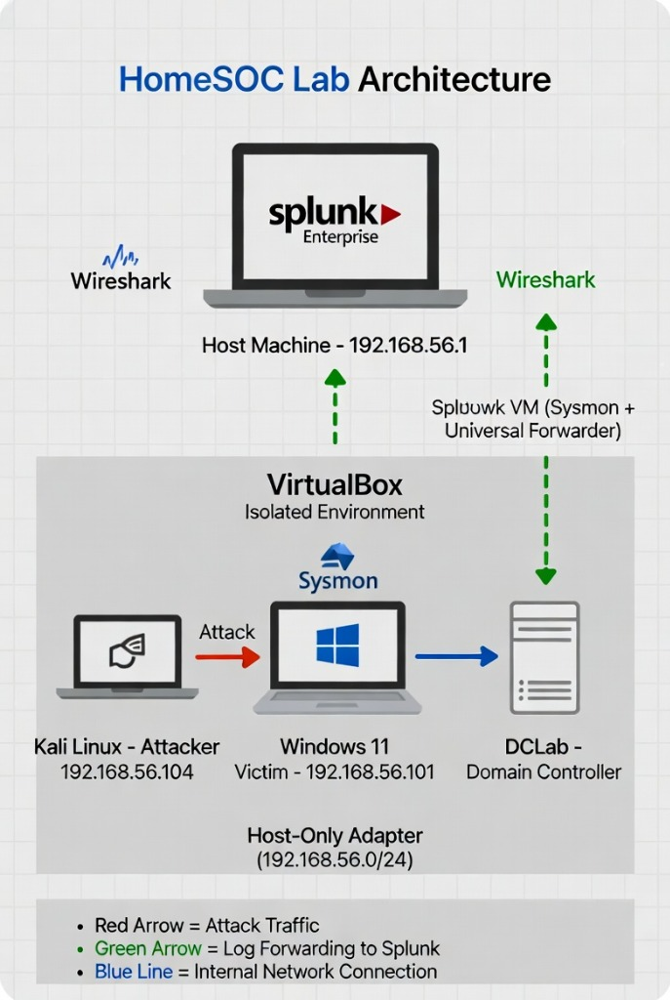

# HomeSOC Lab: End-to-End Threat Simulation & Detection Engineering



## Project Overview
This project is a comprehensive, self-built Security Operations Center (SOC) home lab designed to simulate a modern enterprise network environment. The goal was to build a complete pipeline for threat simulation—from initial reconnaissance to full system compromise—while simultaneously engineering custom detections in Splunk to catch each phase of the attack.

By bridging the gap between offensive techniques (Red Teaming) and defensive analysis (Blue Teaming), this lab demonstrates a deep understanding of the Cyber Kill Chain and the practical application of enterprise security tools like **Splunk**, **Sysmon**, and **Wireshark**.

---

## 🏗️ Lab Architecture
The lab resides within a dedicated, isolated virtual network to ensure safety while maintaining realistic communication between the attacker and the victim.

*   **Attacker Node (Kali Linux):** Used to launch controlled exploits—ranging from Nmap discovery and Hydra brute-forcing to sophisticated Metasploit C2 sessions.
*   **Victim Node (Windows 11):** A hardened endpoint monitored by **Sysmon** (utilizing the SwiftOnSecurity configuration) and a Splunk Universal Forwarder.
*   **SOC Command Center (Host Machine):** Hosts the **Splunk Enterprise** instance for log ingestion, correlation, and dashboarding, alongside **Wireshark** for deep packet inspection.
*   **Network Config:** VirtualBox Host-Only Adapter (192.168.56.0/24) with promiscuous mode enabled for full traffic visibility.

---

## 🛡️ The Five Phases of Attack & Detection
This project documents five progressive attack scenarios, mapped directly to the **MITRE ATT&CK** framework:

1.  **Reconnaissance & Network Mapping** — Identifying open services and potential entry points using aggressive Nmap scanning.
2.  **Initial Access via Brute Force** — Targeting the Remote Desktop Protocol (RDP) using Hydra to simulate credential stuffing and password guessing.
3.  **Exploitation & C2 Establishment** — Deploying a custom Meterpreter reverse TCP payload to gain an interactive Command and Control (C2) session.
4.  **Defense Evasion & Manual File Transfer** — Bypassing Windows Security controls to host and download malicious binaries via an untrusted browser session.
5.  **Privilege Escalation** — Exploiting scheduled tasks (schtasks.exe) to elevate from a standard user to the highest possible rights: **NT AUTHORITY\SYSTEM**.

---

## 📊 Detection Engineering & Dashboards
The heart of this project lies in the detection logic. I developed two advanced Splunk dashboards to visualize the attack lifecycle:

*   **SOC Threat Monitoring:** Tracks real-time endpoint events, authentication spikes, and top malicious IP addresses.
*   **Advanced Threat Detection:** Utilizes sophisticated SPL queries to find "low and slow" attacks—such as successful logins occurring immediately after multiple failures—the definitive footprint of a successful brute-force compromise.

### Example Detection Query (Successful Compromise)
```spl
index=homesoc_sysmon (EventCode=4624 OR EventCode=4625)
| stats sum(eval(if(EventCode==4625,1,0))) as failures 
        sum(eval(if(EventCode==4624,1,0))) as successes 
        dc(Account_Name) as targeted_accounts
        by Source_Network_Address
| where failures > 5 AND successes > 0
```

---

## 🚀 Key Skills & Technologies
*   **SIEM Mastery:** Splunk Enterprise (Log Ingestion, SPL, Dashboard Studio).
*   **Endpoint Visibility:** Sysmon config, Windows Event Log analysis, Universal Forwarder.
*   **Packet Analysis:** Deep dive investigation into .pcap captures via Wireshark.
*   **Offensive Tools:** Kali Linux, Nmap, Hydra, Metasploit (msfvenom/msfconsole).
*   **Incident Response:** Professional reporting and MITRE ATT&CK mapping.

---

## 🔗 Portfolio Access
You can view the full, interactive walkthrough of the lab—including detailed evidence, Splunk screenshots, and technical breakdowns—at the link below:

👉 **[View My HomeSOC Lab Portfolio](index.html)**

---

**Developed by Pelumi Emmanuel Adeniyi** — *Passionate about Cyber Security, Detection Engineering, and SOC Operations.*
